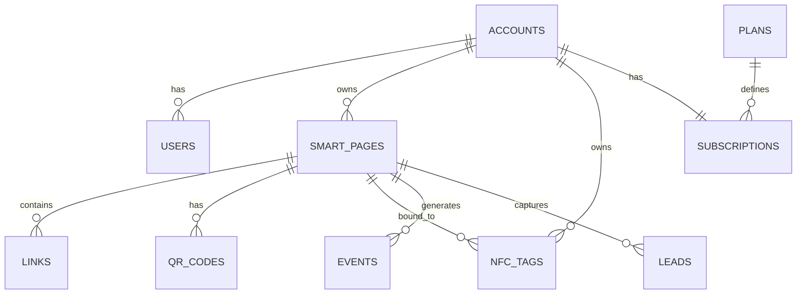

# Hornbill TapTap — Sprint 0: Discovery & Planning

**Status:** In progress (planning mode only — no code)
**Last updated:** 2026-07-22
**Owner:** Kelvin (founder) + AI co-founder

This document is the comprehensive discovery artifact for Sprint 0. It is a living
file — sections marked _(assumption)_ or _(to validate)_ need your confirmation
before Sprint 1.

---

## 1. Problem & opportunity

Small and medium businesses in Kenya have physical touchpoints (a counter, a
reception desk, a business card, a table, a product) but weak, slow ways to convert
that physical moment into a digital action — a Google review, a WhatsApp chat, a
follow, a saved contact, a booking, a payment. Existing tools are fragmented
(separate QR generators, Linktree, printed cards, review-request signage) and none
are M-Pesa-native or built for the local market.

**Opportunity:** one platform where a business owner controls a single smart
destination that a customer reaches by tapping (NFC) or scanning (QR), backed by
analytics and local payments. Hardware (cards/stands) is the acquisition hook; the
recurring software subscription is the business.

## 2. Target user & beachhead

**Beachhead (v1):**

- **Professionals & sales teams** who want a digital business card (save-contact,
  socials, WhatsApp, portfolio) — high perceived value, and every tap markets the
  product itself (built-in virality).
- **SMEs wanting a single smart action** — most commonly "leave us a Google review,"
  "follow us," or "chat on WhatsApp" — via a card, sticker, or counter stand.

Both are served by the **exact same engine**; the only difference is how the owner
configures the page (rich card vs. single redirect).

**Deferred segments (post-PMF):** restaurants/menus, real estate/property,
retail/catalogues, events/check-in, visitor management, employee cards, product
authentication, asset tracking, tourism.

## 3. Core product insight — one engine

There is not a dozen products. There is **one Smart Profile engine** with:

1. A **permanent slug URL** per profile that NFC/QR points to (never reprogrammed).
2. A **mode**: `page` (renders a smart page) or `redirect` (302 to one destination).
3. A **config** (JSON) describing blocks/links/appearance for `page` mode, or the
   target for `redirect` mode.
4. **Event capture** on every tap/scan/view/click.

New "products" later = new **templates + block types**, not new systems. This is the
single most important architectural decision and the reason the scope is buildable
solo.

## 4. MVP scope

### In scope (v1)

- Owner sign-up / login (Supabase Auth).
- Create & edit a Smart Profile: choose slug, mode (`page` or `redirect`), appearance
  (theme, logo, colors), and content.
- **Page mode** blocks: contact info, save-contact (vCard), WhatsApp, call, email,
  website, social links, directions, Google review, custom buttons.
- **Redirect mode**: single destination (any of the above).
- Change destination anytime without touching hardware.
- **Provisioning:** associate an NFC tag / QR code with a profile slug; generate the
  QR image; support first-tap claim flow.
- **Analytics:** taps, scans, page views, per-button clicks, device/OS, day/time,
  and (where feasible/consented) coarse location.
- **Lead capture** block (name/phone/email → owner’s leads list) — optional per page.
- **Subscription billing:** at least one paid tier via M-Pesa and/or card.
- Basic account settings & billing status.

### Explicitly out of scope (v1) — deferred, not cancelled

Teams/branches/multi-user RBAC, white-label & custom domains, agency/reseller plans,
enterprise SSO, most AI features, all non-card/non-redirect product templates
(menus, property, catalogues, events, visitor mgmt, employee cards, product auth,
asset tracking), advanced/predictive analytics, native mobile app.

**Rationale:** solo + bootstrapped. Ship the wedge, get paying users, then expand
templates on the same engine.

## 5. Product requirements (PRD) — MVP user stories

- As a business owner, I can sign up and create my first Smart Profile in under 5
  minutes.
- As an owner, I can pick a unique slug and see it reserved instantly (with reserved-
  word and collision checks).
- As an owner, I can toggle my profile between a full page and a single redirect.
- As an owner, I can edit destinations and appearance and have changes go live
  immediately, without reprinting/reprogramming hardware.
- As an owner, I can download/print a QR for my slug and (later) register a purchased
  NFC card to it.
- As a **customer**, tapping/scanning reaches the destination in well under a second,
  **with no app install**, on typical Kenyan Android and modern iPhones; if NFC is
  unavailable, the QR fallback works.
- As a customer, I can save the owner’s contact (vCard) in one tap.
- As an owner, I can see how many taps/scans/clicks I got, by button, device, and
  time.
- As an owner, I can subscribe to a paid plan and pay with M-Pesa.

**Acceptance criteria (samples):** slug uniqueness enforced at DB level; redirect
p95 latency < 200ms from Kenya; page mode Lighthouse performance ≥ 90 on mid-tier
Android; vCard downloads on iOS Safari and Android Chrome; every public interaction
writes exactly one analytics event.

## 6. Data model (one-engine)

Single Postgres database, multi-tenant by `account_id`, isolated with Row-Level
Security. Core tables:

- **accounts** — the tenant (a business/owner). `id`, `name`, `plan`, `created_at`.
- **users** — Supabase Auth users; linked to an account (v1: one user per account;
  membership table added later for teams).
- **smart_pages** — the engine. `id`, `account_id`, `slug` (unique), `mode`
  (`page`|`redirect`), `config` (jsonb), `theme`, `is_active`, timestamps.
- **links** — individual actions/buttons for `page` mode (or denormalized in
  `config`). `id`, `smart_page_id`, `type`, `label`, `value`, `sort_order`.
- **nfc_tags** — physical tags. `id`, `account_id`, `smart_page_id`, `serial`,
  `status` (`unassigned`|`assigned`), `claimed_at`.
- **qr_codes** — generated QR references. `id`, `smart_page_id`, `image_url`.
- **events** — analytics. `id`, `smart_page_id`, `type` (`tap`|`scan`|`view`|
  `click`), `link_id`, `device`, `os`, `country`, `region`, `referrer`, `ts`.
- **leads** — captured leads. `id`, `smart_page_id`, `name`, `phone`, `email`,
  `meta`, `created_at`.
- **plans** / **subscriptions** — billing. `subscriptions`: `account_id`, `plan`,
  `status`, `provider` (`mpesa`|`card`), `current_period_end`.

**Design notes:** keep flexible content in `smart_pages.config` (jsonb) so new block
types and future templates need no schema migration — this is what makes "add new
products without changing core architecture" true. High-volume `events` table should
be append-only and indexed on `(smart_page_id, ts)`; consider partitioning by month
only once volume justifies it.

## 7. Tenancy & security model

- **Multi-tenancy:** single database, `account_id` on every tenant-owned row,
  enforced with Supabase **Row-Level Security** so a user can only read/write their
  account’s rows. This is simpler and cheaper than schema-per-tenant and scales fine
  for the beachhead; revisit only if a large enterprise/white-label deal demands
  isolation.
- **Auth:** Supabase Auth (email/OTP + optionally Google). Public pages are
  unauthenticated and read-only.
- **Public vs. private:** the redirect/render path is public and must never require
  auth or expose owner PII beyond what the owner chose to publish. Dashboard/API is
  authenticated.
- **PII & consent:** lead capture and analytics involve personal data → explicit
  consent notices, a privacy policy, and data-subject rights (see Compliance).
- **Abuse:** slug reserved-word list; rate-limit lead capture and redirect endpoints;
  validate/normalize outbound redirect targets to avoid open-redirect abuse.
- **Roles (later):** owner/admin/member for teams — schema should not preclude it,
  but don’t build RBAC in v1.

## 8. Non-functional requirements

- **Redirect availability/latency:** the tap target is customer-facing in person.
  Edge-cached, near-100% uptime, p95 < 200ms in Kenya. No cold-start serverless on
  this path.
- **Performance budget:** pages must be light for mid/low-tier Android and expensive
  mobile data — small JS, optimized images, fast first paint.
- **No app required:** works via mobile browser; QR fallback everywhere NFC isn’t
  available.
- **Localization (later):** English first, Swahili-ready.
- **Accessibility:** legible contrast, tap targets, screen-reader labels on public
  pages.

## 9. Architecture (MVP)

- **Next.js on Vercel** for dashboard + public pages + API route handlers.
- **Supabase** for Postgres, Auth, RLS, and Storage (images/logos/vCards).
- **Redirect service:** a dedicated, edge-cached route resolving `slug → destination`
  with minimal DB dependency (cache slug→target; fire analytics asynchronously).
- **Analytics ingestion:** lightweight event write on each interaction; async so it
  never slows the customer path.
- **Payments:** Daraja (M-Pesa STK push) + card provider webhook to update
  `subscriptions`.
- **No standalone Express** — removed to cut ops surface and unify auth (D-003).

## 10. Pricing (draft — validate with the market)

All figures _(assumption, to validate)_ in KES; billed annually-first to reduce M-Pesa
recurring complexity.

| Tier | Price _(draft)_ | Who | Key limits |
|------|----------------|-----|-----------|
| Free | KES 0 | Trials, virality | 1 profile, TapTap branding, basic analytics |
| Starter | ~KES 500/mo or 5,000/yr | Solo professional | 1 profile, custom branding, vCard, no TapTap branding, standard analytics |
| Pro | ~KES 1,500/mo or 15,000/yr | Power users, small biz | Multiple profiles, lead capture, advanced analytics, priority |
| Business | ~KES 4,000/mo | Multi-location (later) | Teams/branches (post-v1), more seats |

**Hardware (one-off, = CAC):** NFC card ~KES 1,500–3,500; counter/review stand
~KES 5,000–10,000 _(assumption — depends on sourcing/COGS)_.

**Billing model (see D-006):** v1 = annual plans via M-Pesa STK push and/or Paystack
card subscriptions. True recurring via **M-Pesa Ratiba** (standing orders) is
available but customer-initiated and fixed-amount — defer until revenue justifies the
integration effort.

## 11. Go-to-market (lean, solo)

- **Land the beachhead** with the digital card (sell to professionals/sales reps you
  can reach directly) and single-redirect review/social cards for nearby SMEs
  (restaurants, salons, clinics, retail).
- **Hardware as the hook:** sell the card/stand once; the value (and the recurring
  fee) is the software behind it.
- **Built-in virality:** every card tap exposes a new person to the product; add a
  subtle "Powered by TapTap" on free tier only.
- **Referral loop** and case studies once the first cohort is live.

## 12. Compliance (do not skip)

- **Kenya Data Protection Act 2019:** you are a data controller/processor (leads,
  analytics, possibly location). Register with the ODPC, publish a privacy policy,
  capture consent for lead forms, and support access/deletion requests.
- **Google review policy:** do **not** implement review gating (filtering happy
  customers to Google while diverting unhappy ones). Solicit reviews neutrally, or
  risk the customer’s Google listing being penalized. This constrains the "Google
  review" product design.
- **Payments:** follow Safaricom/Daraja and card-provider requirements; store no card
  data yourself.
- **Global later:** GDPR-style obligations when expanding beyond Kenya.

## 13. Risk register

| # | Risk | Likelihood | Impact | Mitigation |
|---|------|-----------|--------|-----------|
| R1 | Scope creep — building all product categories | High | High | Enforce one-engine MVP; templates deferred; this doc is the contract |
| R2 | Redirect service downtime/slowness in front of a customer | Med | High | Edge cache, async analytics, uptime monitoring, no cold-start |
| R3 | M-Pesa recurring billing complexity | High | Med | Annual-first billing; defer Ratiba; card fallback |
| R4 | Solo founder bandwidth / burnout | High | High | Ruthless scope, managed services, buy don’t build peripherals |
| R5 | Data Protection Act non-compliance | Med | High | ODPC registration, consent flows, privacy policy before launch |
| R6 | Google review-gating policy violation | Med | High | Neutral review solicitation only |
| R7 | Hardware COGS/logistics (import, defects, cash flow) | Med | Med | Small initial batches; validate supplier; treat as CAC not margin |
| R8 | NFC compatibility on older/cheaper phones | Med | Med | QR fallback everywhere; test on low-tier Android |
| R9 | Competition (Popl/Blinq/local sellers) | Med | Med | Moat = M-Pesa-native + local integrations + analytics depth |
| R10 | Slug/open-redirect abuse | Low | Med | Reserved words, validation, rate limits |

## 14. Open questions — resolved

1. **Timeline & budget:** ✅ Target is a working MVP with first paying customers
   **within ~3 months (by late October 2026)**. No explicit budget ceiling given —
   default to lean/bootstrapped tooling (free/low-cost tiers). _(Revisit if a paid
   service materially accelerates the timeline.)_
2. **Hornbill entity:** ✅ Hornbill is an **existing company** and owns
   `hornbilltech.co.ke`. Legal entity exists for ODPC registration, invoicing, and
   payment onboarding. The root domain already hosts a separate project, so TapTap
   will run on the `taptap.hornbilltech.co.ke` subdomain — which is **not yet
   configured** and needs DNS/SSL set up in Sprint 1.
3. **Storage:** ✅ Confirmed — Supabase Storage for v1 (D-005 accepted).
4. **Billing:** ✅ Confirmed — annual-first via M-Pesa STK push / Paystack, defer
   Ratiba (D-006 accepted).
5. **Domain:** ✅ Public slug domain is the **`taptap.hornbilltech.co.ke` subdomain**
   (the root `hornbilltech.co.ke` is used by another project, so the subdomain is the
   committed home for TapTap). Subdomain DNS/SSL still to be configured in Sprint 1.
   _Optional later:_ a separate short domain for tap URLs.

**Remaining input still useful (not blocking):**

- **First customers:** do you have 5–10 warm prospects (professionals/SMEs) to design
  the MVP around and pilot the hardware with? This shapes v1 defaults and the beta.
- **Budget ceiling:** a rough monthly cap for tools + a first hardware batch would let
  us right-size the pilot.

## 15. Environment routing (Chat / Code / Cowork)

- **Cowork (here):** planning, docs, decision log, pricing/financial modeling,
  research, diagrams, and keeping this source of truth updated.
- **Claude Code:** actual implementation once Sprint 0 is approved — scaffolding,
  coding, tests, deployment config.
- **Claude Chat:** quick one-off questions and snippets that don’t need the repo.

## 16. Sprint 0 — Definition of Done

Sprint 0 is complete when: the MVP scope is agreed, the one-engine data model and
tenancy/security model are approved, pricing direction is set, compliance obligations
are acknowledged with a plan, the risk register is accepted, and all Section 14 open
questions are answered. Only then do we produce the final blueprint and request
approval to begin Sprint 1.

**Status (2026-07-22):** Scope, data model, tenancy/security, pricing direction,
compliance plan, and risk register are drafted and the core decisions (D-001–D-006)
are accepted. Section 14 is resolved except a warm-prospect list (nice-to-have).
**Next:** produce the final Sprint 0 blueprint and request approval to start Sprint 1.

## 17. Indicative timeline (~12 weeks to first paying customers)

Draft phasing for the 3-month target — solo pace, subject to change each sprint.

| Weeks | Sprint | Focus |
|-------|--------|-------|
| 1–2 | Sprint 1 — Foundations | Repo, Supabase schema (accounts, smart_pages, links, events), Auth + RLS, slug reservation, basic edge redirect route |
| 3–5 | Sprint 2 — Smart Profile engine | Page mode + redirect mode, dashboard editor, themes/appearance, vCard, QR generation |
| 6–7 | Sprint 3 — Analytics & leads | Event capture + analytics dashboard (taps/scans/clicks/device/time), lead-capture block |
| 8–9 | Sprint 4 — Billing | Plans/subscriptions, M-Pesa STK push + Paystack, plan gating |
| 10–11 | Sprint 5 — Hardware & compliance | NFC provisioning/claim flow, hardware pilot, performance budget, privacy policy + consent, ODPC registration |
| 12 | Beta | Onboard first customers, iterate on real usage |

_Milestone: a payable, tappable MVP in the hands of the first cohort by ~late
October 2026._
